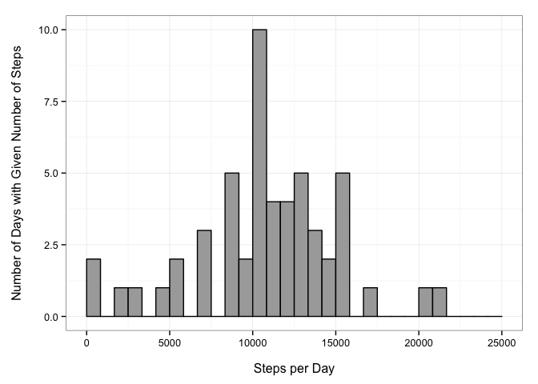
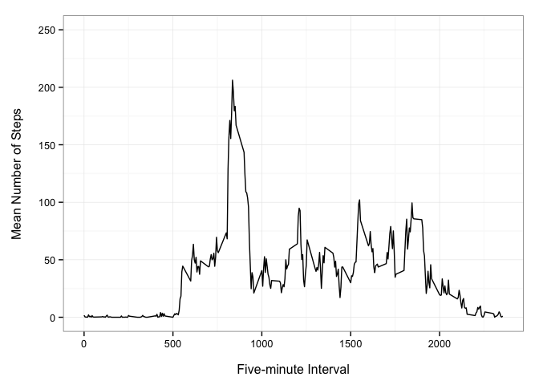
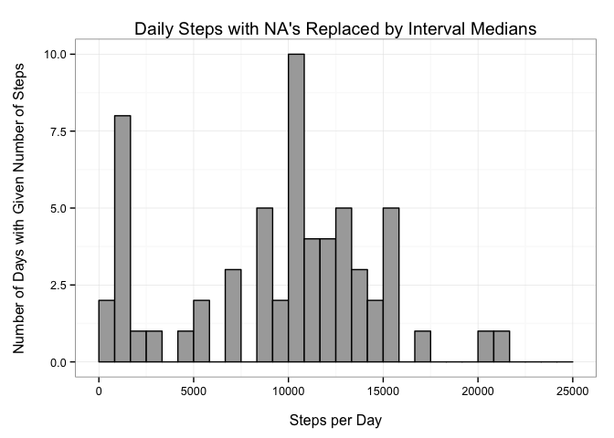
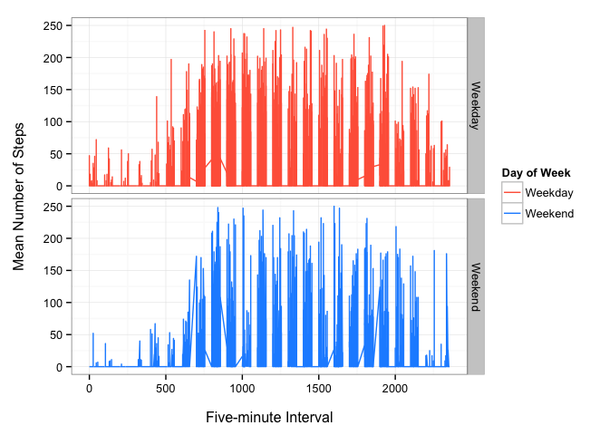

# PA1_template


Download the zip file containing the data from the GitHub site https://github.com/natemiller/RepData_PeerAssessment1/blob/master/activity.zip and unzip.  Load the activity file.

```r
activity <- read.csv("~/Downloads/activity.csv")
```

Specify the format of the date column in the activity dataset and then add a new column in which the date is converted into elapsed day.

```r
activity$date <- as.POSIXct(activity$date, format = "%Y-%m-%d")
activity$day <- as.integer(difftime(activity$date, activity$date[1], units = "days"))
```

Load the dplyr, plyr, and ggplot2 packages for easy analyses and plotting.

```r
library(plyr)
library(dplyr)
```

```
## 
## Attaching package: 'dplyr'
## 
## The following objects are masked from 'package:plyr':
## 
##     arrange, count, desc, failwith, id, mutate, rename, summarise,
##     summarize
## 
## The following object is masked from 'package:stats':
## 
##     filter
## 
## The following objects are masked from 'package:base':
## 
##     intersect, setdiff, setequal, union
```

```r
library(ggplot2)
```

Calculate the number of steps per day by calculating the sum of the number of steps, grouped by day. Using pipes here with dplyr to condense the coding.

```r
stepsPerDay <- 
        activity %>%
        group_by(day) %>%
        summarize(
                count = sum(steps)
                )
```

Plot a histogram to illustrate the distribution of the number of steps per day.

```r
ggplot(stepsPerDay, aes(count)) + 
        geom_histogram(stat = "bin", fill = "darkgrey", colour = "black")+
        scale_x_continuous("\nSteps per Day", limits = c(0, 25000))+
        scale_y_continuous("Number of Days with Given Number of Steps\n", limits = c(0, 10))+
        theme_bw()
```

```
## stat_bin: binwidth defaulted to range/30. Use 'binwidth = x' to adjust this.
```

 

Report the mean and median number of steps per day

```r
mean(stepsPerDay$count, na.rm = TRUE)
```

```
## [1] 10766.19
```

```r
median(stepsPerDay$count, na.rm = TRUE)
```

```
## [1] 10765
```

Calculate the mean steps per time interval across all days in the dataset by calculating the mean steps, grouped by time interval.

```r
meanStepsPerInt <- 
        activity %>%
        group_by(interval) %>%
        summarize(
                meanSteps = mean(steps, na.rm = TRUE)
                )
```


Make a time series plot to illustrate the pattern in the mean number of steps during the day (across intervals).

```r
ggplot(meanStepsPerInt, aes(interval, meanSteps))+
        geom_line()+
        scale_x_continuous("\nFive-minute Interval", limits= c(0, 2355))+
        scale_y_continuous("Mean Number of Steps\n", limits = c(0, 250))+
        theme_bw()
```

 

Identify the time interval on average had the maximum number of steps.

```r
meanStepsPerInt[which.max(meanStepsPerInt$meanSteps),]
```

```
## Source: local data frame [1 x 2]
## 
##   interval meanSteps
## 1      835  206.1698
```
In this case it is interval 835.  


Count how many rows have at least one NA using is.na function.

```r
sum(is.na(activity))
```

```
## [1] 2304
```

Create a new dataframe (activity2) in which NA values are replaced by the median step value for that time interval across all days.

```r
activity2 <- ddply(activity, .(interval), mutate, steps = ifelse(is.na(steps), median(steps, na.rm = TRUE), steps))
```

Using the new dataset with the NA's replaced by the median steps for that time interval calculate the daily maximum number of steps.  Plot that data as a histrogram to see how the distribution of maximum step number per day shifts as a result of replacing the NA's.

```r
 stepsPerDay_2 <-
        activity2 %>%
        group_by(day) %>%
        summarize(
                count = sum(steps)
                )

ggplot(stepsPerDay_2, aes(count))+
        geom_histogram(stat = "bin", fill = "darkgrey", colour = "black")+
        scale_x_continuous("\nSteps per Day", limits = c(0, 25000))+
        scale_y_continuous("Number of Days with Given Number of Steps\n", limits = c(0, 10))+
        theme_bw()+
        labs(title = "Daily Steps with NA's Replaced by Interval Medians")
```

```
## stat_bin: binwidth defaulted to range/30. Use 'binwidth = x' to adjust this.
```

 

Calculate the mean and median number of steps per day for the new dataset in which all NA's were replaced by interval median.

```r
mean(stepsPerDay_2$count, na.rm = TRUE)
```

```
## [1] 9503.869
```

```r
median(stepsPerDay_2$count, na.rm = TRUE)
```

```
## [1] 10395
```
The mean and median for this second dataset are different from those calculated in the first portion of the assignment but the histogram suggests that the data is now more skewed with more smaller values.  Replacing the NA's has moved both the mean and the median number of steps lower, though the mean was more sensitive and has changed more.  
  
    
Using the second dataset identify those days in the dataset that are weekdays and those that are weekends.  The data is plotted in dual panels to identify different patterns in steps during the day on weekdays and weekends. It appears that on weekends there is less early morning (activity) though activity does not appear to go later into the night on weekends, suggesting that activity windows are simply narrower on weekends.


```r
activity2$weekday <- ifelse(
        weekdays(activity2$date, abbreviate = TRUE) == "Mon" | 
        weekdays(activity2$date, abbreviate = TRUE) == "Tue" |
        weekdays(activity2$date, abbreviate = TRUE) == "Wed" |
        weekdays(activity2$date, abbreviate = TRUE) == "Thu" |
        weekdays(activity2$date, abbreviate = TRUE) == "Fri" , 
        "Weekday", "Weekend"
                        )
```


```r
ggplot(activity2, aes(interval, steps))+
        geom_line(aes(colour = factor (weekday))) +
        scale_x_continuous("\nFive-minute Interval", limits= c(0, 2355))+
        scale_y_continuous("Mean Number of Steps\n", limits = c(0, 250))+
        theme_bw()+
        facet_grid(weekday ~.)+
        scale_colour_manual("Day of Week", values = c("tomato", "dodgerblue"))
```

 
